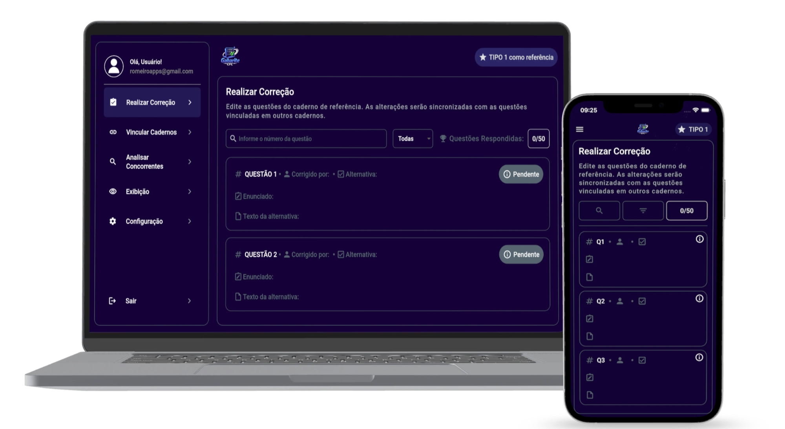
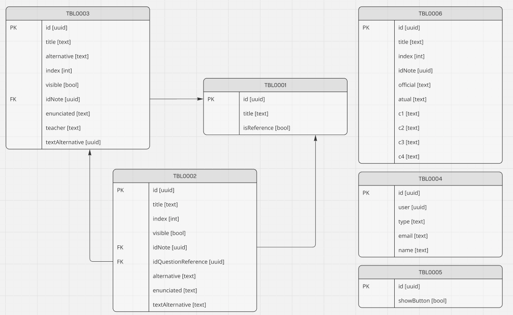

<h1>Gabarite CFC</h1>

    
O <strong>Gabarite CFC</strong> é um sistema desenvolvido para o gerenciamento das questões do Exame de Suficiência do CFC, permitindo a criação de relações entre questões correlatas, análise do gabarito dos concorrentes e a organização dos dados para apresentação das respostas no painel.

    

<h2>Começando</h2>

    Para começar, certifique-se de que tem o Flutter instalado na sua máquina. Caso contrário, pode seguir o guia oficial de instalação do Flutter aqui.  
    Clone este repositório para o seu computador local:

<pre><code>git clone https://github.com/fgsromeiro/gabarite_cfc.git

-> Para acessar o gerenciador
cd manager

-> Para acessar o quadro
cd board
</code></pre>

Em seguida, instale as dependências e execute o projeto::

<pre><code>flutter pub get
flutter run
</code></pre>

Agora você está pronto para usar o Gabarite CFC!

<h2>Tecnologias Utilizadas</h2>

<ul>
    <li>Linguagem: Dart</li>
    <li>Framework: Flutter</li>
    <li>Gerenciador de Estado: Bloc/Cubit</li>
    <li>Banco de dados: Supabase</li>
    <li>Infra / DevOps: Globe</li>
</ul>

<h2>Estrutura do Projeto</h2>

    Ambos os projetos está organizado para facilitar a compreensão e o desenvolvimento. As pastas principais incluem:

**`src`**: contém todo o código-fonte Dart da aplicação Flutter.

- **`init`**: arquivo responsável pela inicialização da aplicação.
- **`modules`**: módulos que agrupam as funcionalidades do sistema, organizados por domínio ou feature.
- **`routes`**: gerenciamento e definição das rotas de navegação da aplicação.
- **`shared`**: recursos e utilitários compartilhados entre os módulos, como helpers, serviços e constantes.
- **`themes`**: configurações do tema padrão da aplicação (cores, tipografia, estilos).
- **`ui`**: widgets globais e componentes reutilizáveis da interface.

<h2>Funcionalidades</h2>

    Abaixo estão as principais funcionalidades do Gabarite CFC:

| Título  | Descrição |
| ------------- |:-------------:|
| Realizar Correção| Funcionalidade que realiza o cadastro das respostas.|
| Vincular Cadernos | Funcionalidade que realiza o vínculo das questões entre os cadernos (TIPO 1, TIPO 2, TIPO 3 e TIPO 4). |
| Analisar Concorrentes      | Funcionalidade que cadastra o gabarito dos concorrentes e do gabarito oficial.     |
| Exibição      | Funcionalidade que libera a visibilidade da alternativa no quadro de resposta.     |

<h2>Modelagem de Dados</h2>

    A modelagem de dados do projeto foi projetada para garantir uma estrutura baseada em entidades bem definidas, atendendo às necessidade funcionais e não funcionais da aplicação.

| Entidade  | Descrição |
| ------------- |:-------------:|
| TBL0001 | Armazena os tipos de caderno de questão. |
| TBL0002 | Armazena todas as questões do projeto. |
| TBL0003 | Armazena as questões do caderno referência que irá auxiliar no vinculo das questões. |
| TBL0004 | Armazena as permissões do usuário. |
| TBL0005 | Gerencia as configurações do quadro. |
| TBL0006 | Armazena os concorrentes |

  
<strong>DIAGRAMA ER (Entidade-Relacionamento)</strong>

 
 

<h2>Licença</h2>

    Este projeto está licenciado sob a Licença MIT - veja o arquivo <a href="../LICENSE">LICENSE</a> para mais detalhes.
